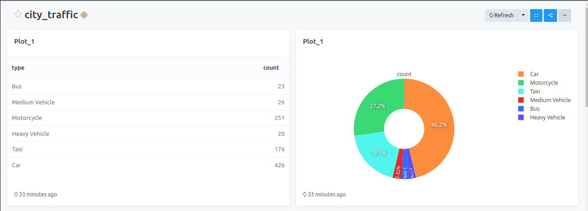
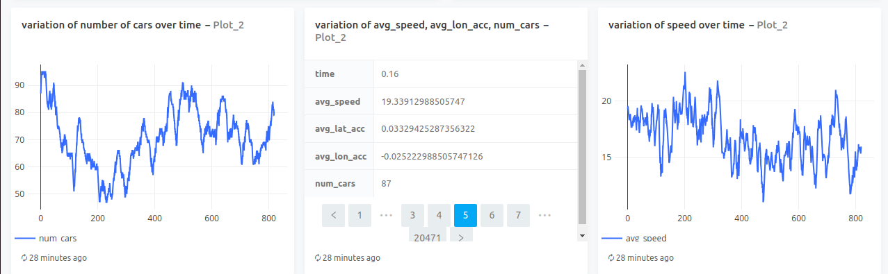
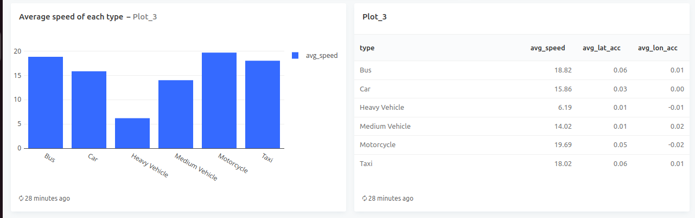
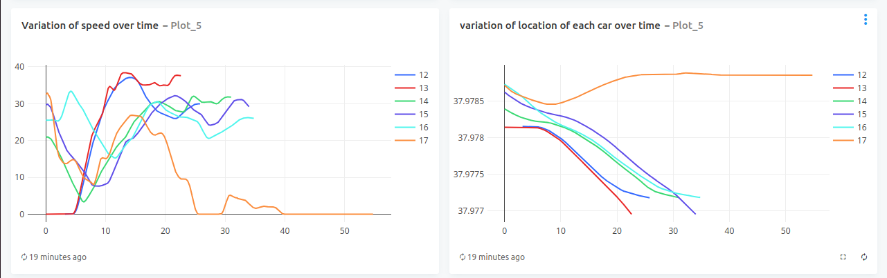

# City Traffic Data Warehouse
This repository holds the code and configuration for a scalable data warehouse designed to store and analyze vehicle trajectory data collected by swarm UAVs and static roadside cameras in a city traffic department. The data warehouse utilizes the ELT (Extract, Load, Transform) framework with DBT, allowing analysts to define data transformations on-demand.

# Repository structure
- **/airfolw**: Contains code for creating a DAG and storing data to postgresql database.
- **/city_traffic_dbt**: DBT models for transforming raw data into a structured format.
- **/redash**: contains code for creating dashboards.

# Getting Started
Clone the repository:
   ```bash
    git clone https://github.com/Misganaw-Berihun/City_traffic_data_warehouse.git
    cd traffic-data-warehouse
   ```

# Dash board




